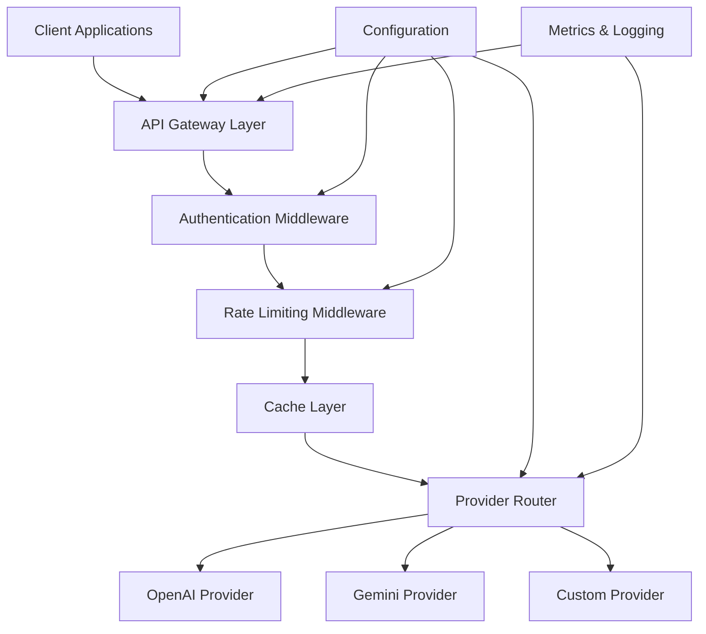

# Design Document

## Overview

The LLM API Route Proxy Server is designed as a modular, extensible Go application that provides a unified gateway for multiple Large Language Model providers. The system follows a clean architecture pattern with clear separation of concerns, leveraging dependency injection through Uber's FX framework for maintainable and testable code.

The proxy server acts as an intelligent middleware layer that:
- Routes requests to appropriate LLM providers based on configurable rules
- Transforms requests/responses between different provider formats
- Provides cross-cutting concerns like authentication, rate limiting, caching, and monitoring
- Supports both streaming and non-streaming responses
- Enables failover and load balancing across providers

## Architecture

### High-Level Architecture



### Layered Architecture

1. **API Gateway Layer**: HTTP server handling incoming requests and responses
2. **Middleware Layer**: Cross-cutting concerns (auth, rate limiting, logging, caching)
3. **Routing Layer**: Provider selection and request routing logic
4. **Provider Layer**: LLM provider implementations and abstractions
5. **Configuration Layer**: Configuration management and hot-reloading
6. **Infrastructure Layer**: Logging, metrics, health checks

## Components and Interfaces

### Core Interfaces

#### Provider Interface
```go
type Provider interface {
    Generate(ctx context.Context, req *GenerateRequest) (*GenerateResponse, error)
    StreamGenerate(ctx context.Context, req *GenerateRequest) (io.ReadCloser, error)
    GetCapabilities() ProviderCapabilities
    Close() error
}

type ProviderCapabilities struct {
    SupportsStreaming bool
    SupportsFunctions bool
    MaxTokens         int
    SupportedModels   []string
}
```

#### Middleware Interface
```go
type Middleware interface {
    Handle(next http.Handler) http.Handler
}

type AuthMiddleware interface {
    Middleware
    ValidateToken(token string) (*AuthContext, error)
}

type RateLimitMiddleware interface {
    Middleware
    CheckLimit(clientID string, endpoint string) error
}
```

#### Router Interface
```go
type Router interface {
    Route(req *RouteRequest) (Provider, error)
    GetProviderForModel(model string) (Provider, error)
    RegisterProvider(name string, provider Provider) error
    ListProviders() []ProviderInfo
}

type RouteRequest struct {
    Model      string
    ClientID   string
    Endpoint   string
    Headers    map[string]string
}
```

#### Cache Interface
```go
type Cache interface {
    Get(key string) ([]byte, bool)
    Set(key string, value []byte, ttl time.Duration) error
    Delete(key string) error
    Clear() error
}
```

### Component Structure

#### 1. HTTP Server Component (`internal/server`)
- **Handler Registry**: Manages route registration and middleware chain
- **Request Processor**: Handles request parsing and response formatting
- **Streaming Manager**: Manages SSE connections for streaming responses
- **Health Check Handler**: Provides system health endpoints

#### 2. Provider Management (`internal/provider`)
- **Provider Registry**: Manages provider lifecycle and discovery
- **Provider Router**: Implements routing logic based on configuration
- **Provider Adapters**: Concrete implementations for each LLM provider
- **Response Transformer**: Standardizes responses across providers

#### 3. Middleware Stack (`internal/middleware`)
- **Authentication Middleware**: Token validation and user context
- **Rate Limiting Middleware**: Request throttling and quota management
- **Caching Middleware**: Response caching with configurable TTL
- **Logging Middleware**: Request/response logging and metrics
- **CORS Middleware**: Cross-origin request handling

#### 4. Configuration Management (`internal/config`)
- **Config Loader**: YAML configuration parsing and validation
- **Hot Reload Manager**: Configuration updates without restart
- **Environment Override**: Environment variable support
- **Validation Engine**: Configuration schema validation

#### 5. Observability (`internal/observability`)
- **Metrics Collector**: Prometheus-compatible metrics
- **Logger**: Structured logging with configurable levels
- **Tracer**: Distributed tracing support
- **Health Monitor**: System health and readiness checks

## Data Models

### Request/Response Models

```go
type StandardRequest struct {
    Model       string                 `json:"model"`
    Messages    []Message             `json:"messages"`
    Stream      bool                  `json:"stream,omitempty"`
    MaxTokens   *int                  `json:"max_tokens,omitempty"`
    Temperature *float64              `json:"temperature,omitempty"`
    Functions   []Function            `json:"functions,omitempty"`
    Metadata    map[string]interface{} `json:"metadata,omitempty"`
}

type StandardResponse struct {
    ID       string    `json:"id"`
    Object   string    `json:"object"`
    Created  int64     `json:"created"`
    Model    string    `json:"model"`
    Choices  []Choice  `json:"choices"`
    Usage    Usage     `json:"usage"`
    Metadata map[string]interface{} `json:"metadata,omitempty"`
}

type Message struct {
    Role      string                 `json:"role"`
    Content   string                 `json:"content"`
    Name      *string               `json:"name,omitempty"`
    Function  *FunctionCall         `json:"function_call,omitempty"`
    Metadata  map[string]interface{} `json:"metadata,omitempty"`
}
```

### Configuration Models

```go
type Config struct {
    Server      ServerConfig      `yaml:"server"`
    Providers   ProvidersConfig   `yaml:"providers"`
    Routing     RoutingConfig     `yaml:"routing"`
    Auth        AuthConfig        `yaml:"auth"`
    RateLimit   RateLimitConfig   `yaml:"rate_limit"`
    Cache       CacheConfig       `yaml:"cache"`
    Observability ObservabilityConfig `yaml:"observability"`
}

type RoutingConfig struct {
    Rules       []RoutingRule     `yaml:"rules"`
    Fallback    FallbackConfig    `yaml:"fallback"`
    LoadBalance LoadBalanceConfig `yaml:"load_balance"`
}

type RoutingRule struct {
    Name        string            `yaml:"name"`
    Conditions  []Condition       `yaml:"conditions"`
    Provider    string            `yaml:"provider"`
    Model       *string           `yaml:"model,omitempty"`
    Weight      *int              `yaml:"weight,omitempty"`
}
```

## Error Handling

### Error Categories

1. **Client Errors (4xx)**
   - Invalid request format
   - Authentication failures
   - Rate limit exceeded
   - Unsupported model/provider

2. **Server Errors (5xx)**
   - Provider unavailable
   - Internal processing errors
   - Configuration errors
   - Timeout errors

### Error Response Format

```go
type ErrorResponse struct {
    Error ErrorDetail `json:"error"`
}

type ErrorDetail struct {
    Type    string `json:"type"`
    Code    string `json:"code"`
    Message string `json:"message"`
    Details map[string]interface{} `json:"details,omitempty"`
}
```

### Retry and Failover Strategy

1. **Circuit Breaker Pattern**: Prevent cascading failures
2. **Exponential Backoff**: Retry with increasing delays
3. **Provider Failover**: Automatic fallback to alternative providers
4. **Graceful Degradation**: Fallback to cached responses when possible

## Testing Strategy

### Unit Testing
- **Provider Implementations**: Mock external API calls
- **Middleware Components**: Test individual middleware behavior
- **Configuration Loading**: Validate config parsing and validation
- **Request/Response Transformation**: Test format conversions

### Integration Testing
- **End-to-End API Tests**: Full request/response cycles
- **Provider Integration**: Test with real provider APIs (optional)
- **Middleware Chain**: Test complete middleware stack
- **Configuration Hot-Reload**: Test runtime config updates

### Performance Testing
- **Load Testing**: Concurrent request handling
- **Streaming Performance**: Large response streaming
- **Cache Performance**: Cache hit/miss scenarios
- **Rate Limiting**: Throttling behavior under load

### Test Structure
```
tests/
├── unit/
│   ├── provider/
│   ├── middleware/
│   ├── config/
│   └── server/
├── integration/
│   ├── api/
│   ├── providers/
│   └── e2e/
└── performance/
    ├── load/
    └── stress/
```

### Testing Tools and Frameworks
- **Testing Framework**: Go's built-in testing package with testify
- **Mocking**: gomock for interface mocking
- **HTTP Testing**: httptest for server testing
- **Load Testing**: Custom Go benchmarks and external tools
- **Provider Mocking**: Mock servers for provider APIs

### Continuous Integration
- **Automated Testing**: Run all test suites on PR/commit
- **Coverage Reporting**: Maintain >80% code coverage
- **Integration Tests**: Optional real provider tests with API keys
- **Performance Regression**: Benchmark comparison against baseline